

	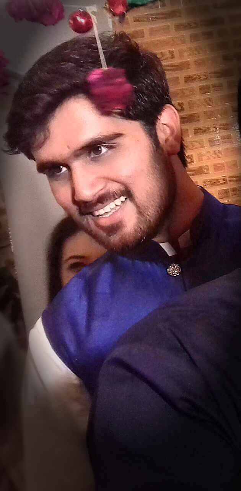 

<h1 align="center">Syed Uzair Abbas</h1>
<h3 align="center">Web Developer </h3>

	
	
	
	

I compeleted my 'Bachelor of Science in Computer Science' in 'September,2019' from <a href="http://case.edu.pk/">“CASE” </a> and done my 'Final Yera Project'with <a href="http://www.letsinnovate.net/">“LETS INNOVATE” </a> and complete internship of 3 months from <a href="https://www.pace-tech.com/">“PACE TECH” </a>, Islamabad. 

 As a passionate and motivated professional, I have constantly improved my techniques, expanded my skillset and found new opportunities to grow. I am eager to constantly learn new things. 

<h1 align="center">Work Experience</h1>

<!-- OBE -->

	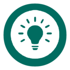

<h3 align="center">OBE Based FYP Management System</h3>

OBE (Outcome-Based Education) based FYP (Final Year Project)
Management System for evaluation of Final year projects on an
automated online system using website and mobile application.This project/product is for the company
 <a href="http://www.letsinnovate.net/">“LETS INNOVATE” </a>

	<code>Ionic</code>
	<code>Html</code>
	<code>CSS</code>
	<code>Bootstrap</code>
	<code>JavaScript</code>
	<code>PHP</code>
	

<h4 align="center">App</h4>

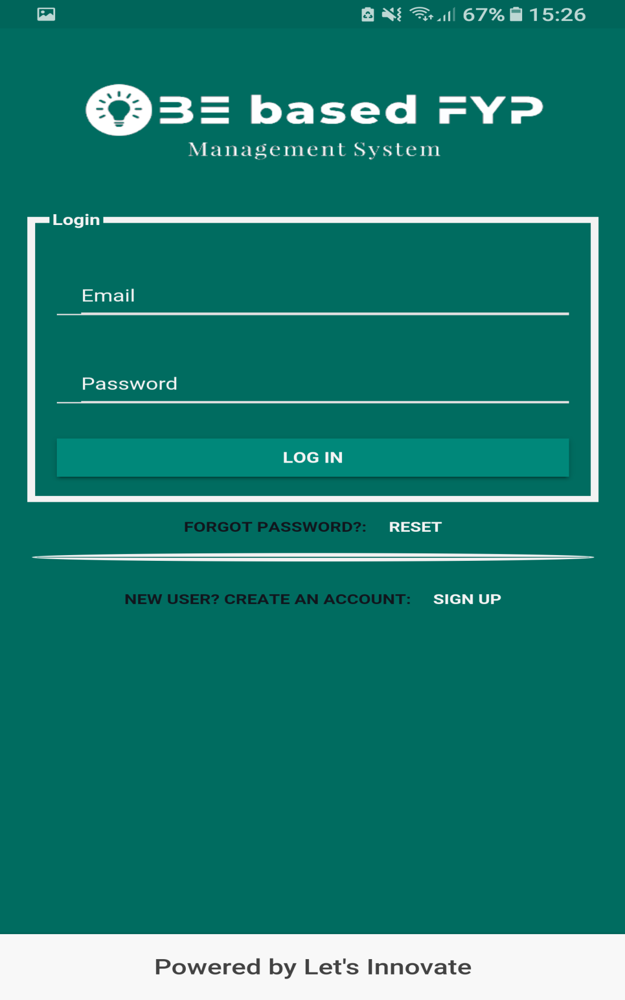
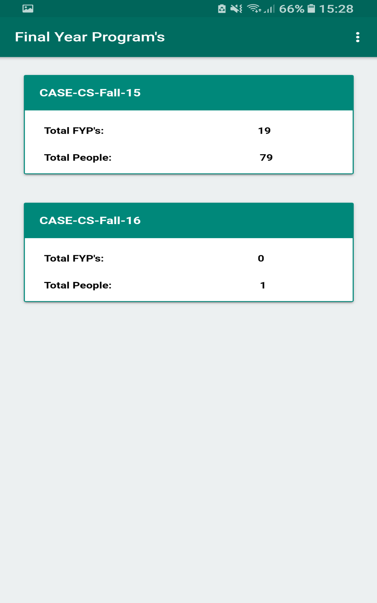
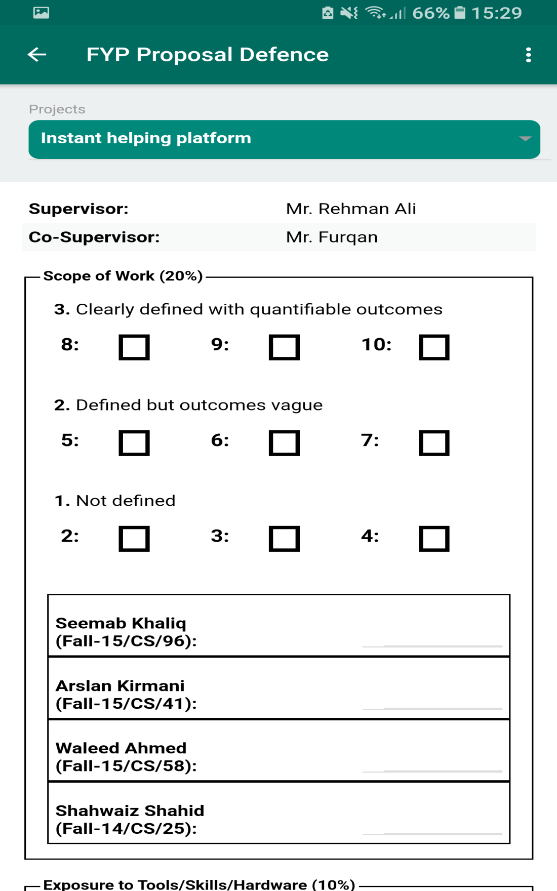

<h4 align="center">Web</h4>

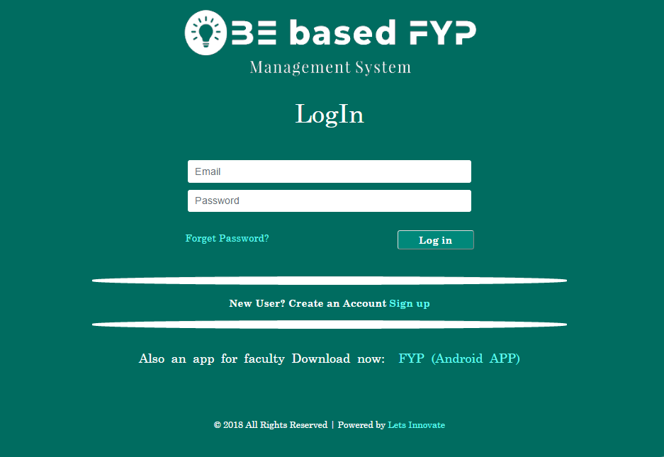
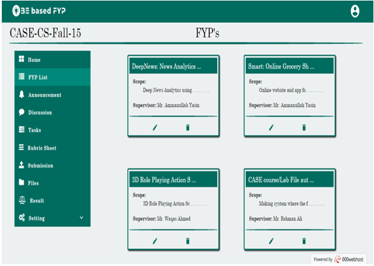

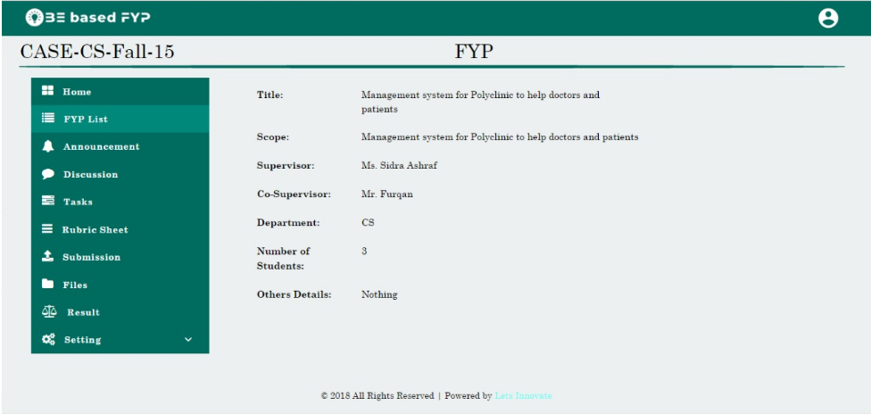
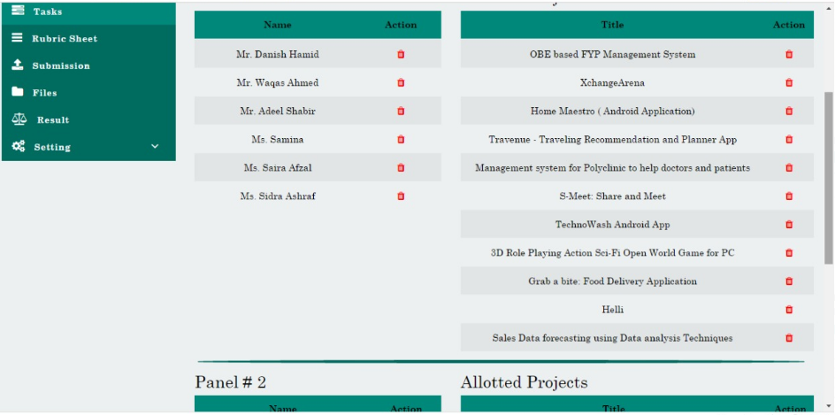

<!-- OBE -->
 

<!-- PACETECH -->
 
<h3 align="center">Internal Resources Portal</h3>

The purpose of developing this “Internal Resources Portal” is to make a centeral platform for company internal use to get the icons for the project(s) & also upload the icons. It gives access to all departments (designers, web-developers, app-developers) to get the icons which thay want in svg formate.

	<code>Codeignitor</code>
	<code>Html</code>
	<code>CSS</code>
	<code>Bootstrap</code>
	<code>JavaScript</code>
	<code>PHP</code>

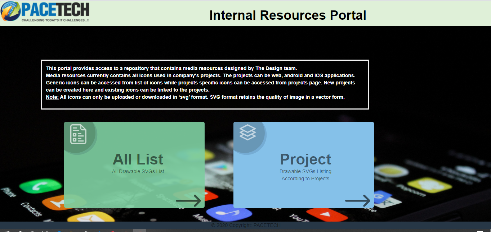
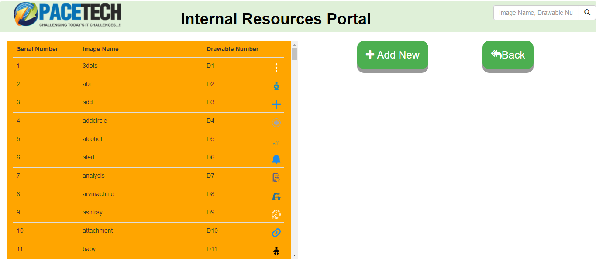
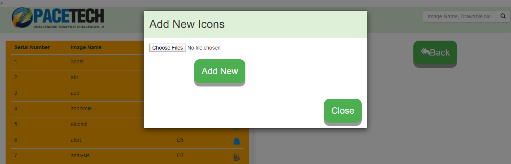

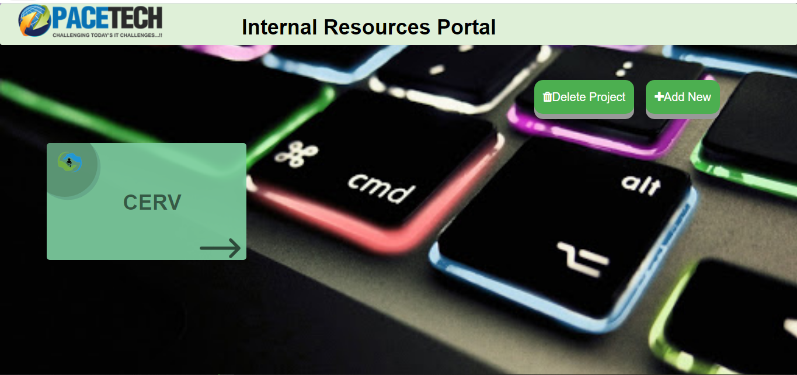
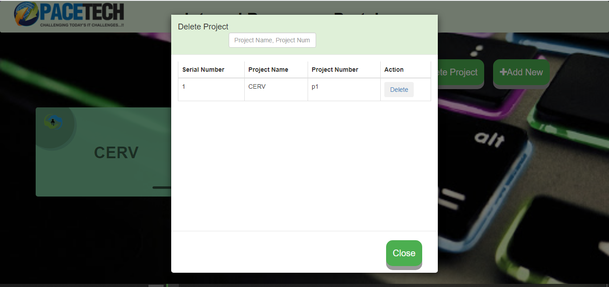
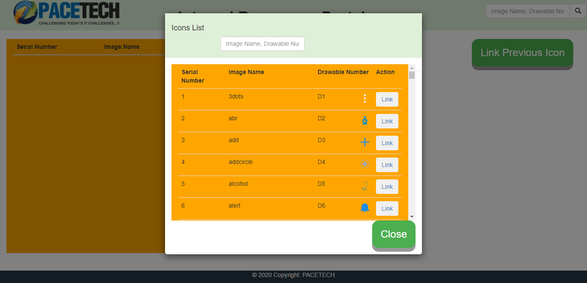

<!-- PACETECH -->
 

